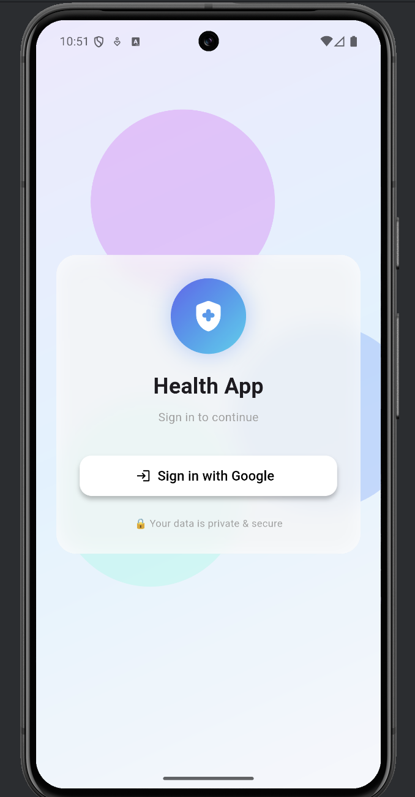
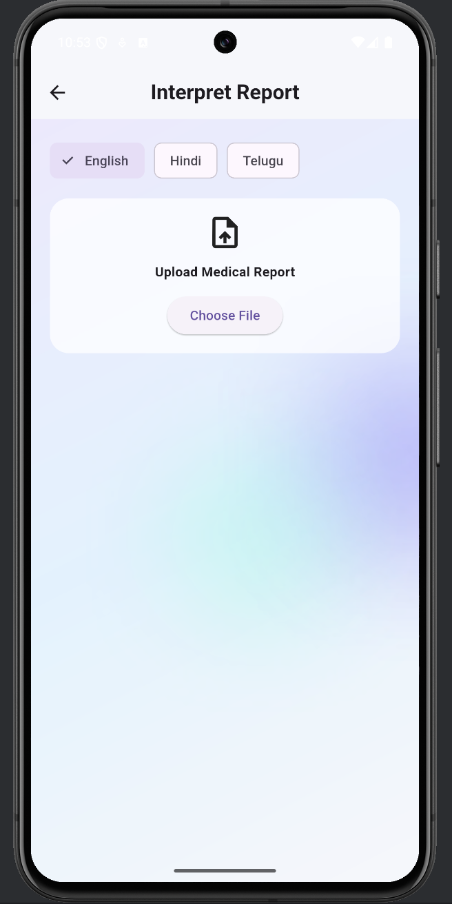

# 🩺 HealthiE - AI Health Companion  

*A Flutter-powered mobile app that simplifies medical reports using AI, making healthcare accessible and understandable for everyone.*  

---

## ✨ Why HealthiE?  
Medical reports are confusing. HealthiE changes that.  
Upload your report, ask questions in plain language, and get **clear, personalized insights** powered by AI—all in your preferred language.

---

## 🚀 Features That Matter  

| Feature | Description |  
|---------|-------------|  
| **🔐 Secure Login** | Google Sign-In for one-tap access. |  
| **📄 Smart Report Upload** | Upload PDFs/images; AI extracts and explains key terms. |  
| **🧠 AI-Powered Insights** | Get simplified explanations of medical jargon. |  
| **🗣️ Voice & Chat** | Ask health questions via text or voice (English, Hindi, Telugu). |  
| **⏰ Medicine Reminders** | Never miss a dose with smart notifications. |  
| **📊 Health History** | Securely store and revisit past reports. |  

---

## 📸 See It in Action  

| Login & Dashboard | Report Upload | AI Insights |  
|-------------------|---------------|-------------|  
|  |  |  |  

 

---

## 🛠️ Tech Stack  

**Frontend:** Flutter (Dart)  
**Backend:** Firebase (Auth, Firestore, Storage)  
**AI/ML:** OpenAI GPT API  
**Platforms:** Android (iOS ready)  
**State Management:** Provider  
**Other Tools:** HTTP, Image Picker, Firebase Messaging  

---

## 📦 Getting Started  

### 1. **Clone the Repository**  
```bash
git clone https://github.com/MoteeshA/AI_Health_App.git
cd Health
```

### 2. **Install Dependencies**  
```bash
flutter pub get
```

### 3. **Set Up Firebase**  
1. Create a Firebase project and add Android/iOS apps.  
2. Download `google-services.json` (Android) or `GoogleService-Info.plist` (iOS).  
3. Place them in `android/app/` or `ios/Runner/`.  
4. **Never commit these files** (already in `.gitignore`).  

### 4. **Configure OpenAI API Key**  
Run or build the app with:  
```bash
flutter run --dart-define=OPENAI_API_KEY=your_api_key_here
```

### 5. **Run the App**  
```bash
flutter run
```

---

## 🔐 Security First  

- API keys are passed via `--dart-define` and **never stored in code**.  
- User data is encrypted and stored securely in Firebase.  
- Google Sign-In ensures authenticated access.  

---

## 📁 Project Structure  

```
Health/
├── lib/
│   ├── models/          # Data models (User, Report, etc.)
│   ├── screens/         # All UI screens
│   ├── services/        # Firebase, API, AI services
│   ├── utils/           # Helpers & constants
│   ├── widgets/         # Reusable UI components
│   └── main.dart        # App entry point
├── android/             # Android-specific files
├── ios/                 # iOS-specific files
├── screenshots/         # App screenshots
├── pubspec.yaml         # Dependencies
└── README.md            # You are here :)
```

---

## 🧪 Development Status  

| Feature | Status |  
|---------|--------|  
| Core UI/UX | ✅ **Done** |  
| Firebase Integration | ✅ **Done** |  
| AI Report Analysis | ✅ **Done** |  
| Multi-language Support | 🚧 **In Progress** |  
| App Store Deployment | 📅 **Planned** |  

---

## 🤝 Contributing  

We welcome contributions!  
1. Fork the repository.  
2. Create a feature branch (`git checkout -b feature/AmazingFeature`).  
3. Commit changes (`git commit -m 'Add AmazingFeature'`).  
4. Push to branch (`git push origin feature/AmazingFeature`).  
5. Open a Pull Request.  

---

## ⚠️ Important Disclaimer  

> **HealthiE is an AI assistant, not a doctor.**  
> It helps you understand medical terms but **does not provide medical advice**.  
> Always consult a healthcare professional for diagnosis and treatment.

---

## 🌟 Show Your Support  

If this project helps you, give it a **star** ⭐ on GitHub!  

---

## 👨‍💻 Author  

**Moteesh Annadanam**  
- GitHub: [@MoteeshA](https://github.com/MoteeshA)  
- LinkedIn: [Moteesh Annadanam](https://www.linkedin.com/in/moteesh-annadanam-31a265273/)  

---

## 📄 License  

This project is licensed under the MIT License.  
See the [LICENSE](LICENSE) file for details.

---


